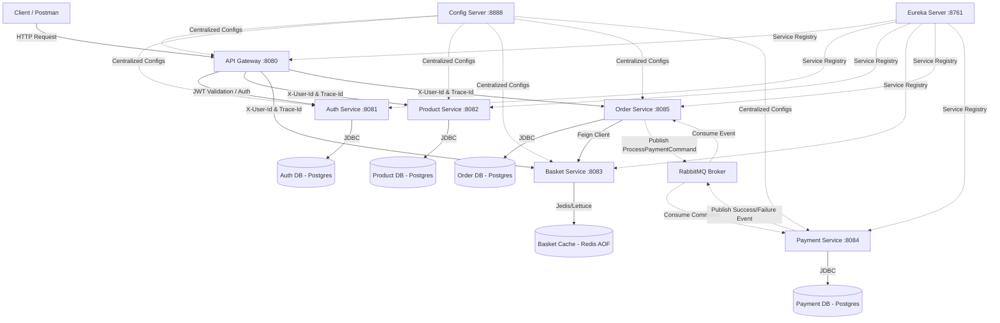

# Cloud-Native E-Commerce Microservices Platform

A production-ready, distributed e-commerce backend built with Java 21, Spring Boot, and Spring Cloud. This platform resolves critical architecture patterns in microservice environments, including distributed transaction orchestration via a custom Saga State Machine over RabbitMQ, centralized configuration management, edge security propagation, and end-to-end trace correlation.

---

## Key Features

* **Centralized Configuration Management**: Remote configuration distribution managed by Spring Cloud Config Server, backed by a dedicated Git repository (`ecommerce-config-repo`) integrated as a Git Submodule. This allows hot-reloading of properties without service restarts.
* **Unified Edge Router & API Gateway**: Handles external traffic via Spring Cloud Gateway (MVC), performing unified JWT verification, dynamic routing, and Swagger UI aggregation.
* **Security & Identity Propagation**: Employs a zero-trust downstream architecture. The Gateway extracts the user identifier from incoming JWTs and propagates it to downstream services via the `X-User-Id` header, eliminating JWT validation overhead in core services.
* **Distributed Transactions via Saga Orchestration**: Implements eventual consistency across the Order, Basket, and Payment services using an asynchronous Saga Orchestrator pattern. Order state changes are governed by a robust, custom-built State Machine (`OrderStateManager`).
* **Asynchronous Message-Driven Communications**: Leverages RabbitMQ broker for decoupled, resilient service communication. Employs dedicated command queues (`ProcessPaymentCommand`) and event streams (`PaymentCompletedEvent`, `PaymentFailedEvent`).
* **High-Performance Persistent Caching**: Implements fast and volatile session/cart storage inside the Basket Microservice using Redis. Features Append-Only File (AOF) and RDB persistence models to ensure zero data loss during memory recycles.
* **Observability & Request Correlation**: Tracks distributed requests across network boundaries and messaging boundaries. Automatically generates a unique correlation `Trace-Id` at the gateway, propagates it via HTTP headers and RabbitMQ metadata, and maps it to logs using Logback Mapped Diagnostic Context (MDC).
* **Dockerless Containerization via Jib**: Builds highly optimized, layered OCI container images directly to local Docker daemons using the Google Jib Maven plugin, eliminating the maintenance cost of custom Dockerfiles.
* **Transactional Idempotency**: Secures critical business transactions (e.g. payments) against double-billing by applying unique business constraints and database validation checks during duplicate command retries.

---

## Tech Stack

| Category | Technology | Purpose |
| :--- | :--- | :--- |
| **Languages & Core Runtime** | Java 21 (LTS), SQL | Primary development runtime & relational queries |
| **Core Framework** | Spring Boot 4.0.6, Spring MVC | Core application framework & servlet web container |
| **Cloud Infrastructure** | Spring Cloud Gateway, Netflix Eureka Server, Spring Cloud Config | Unified routing, service registry, and centralized properties |
| **Inter-Service Communication** | Spring Cloud OpenFeign, RabbitMQ (AMQP) | Synchronous HTTP clients & asynchronous message-driven queues |
| **Database & Caching** | PostgreSQL, Redis (AOF/RDB enabled), Spring Data JPA | Relational database, high-performance persistable cache, Hibernate ORM |
| **Image Building & Orchestration** | Google Jib Maven Plugin, Docker & Docker Compose | Dockerless container compilation & multi-container setup |
| **API Documentation** | Springdoc OpenAPI, Swagger UI | Automated OpenAPI schema generation and aggregated UI portal |
| **Testing** | JUnit 5, Mockito, Testcontainers | Unit testing, mock isolation, and containerized database testing |
| **Utilities** | Project Lombok, Logback MDC | Boilerplate reduction & cross-network logging context |

---

## Project Architecture and Folder Structure

The project implements a **Layered Domain Architecture** (Controller -> Service -> Repository) within decoupled, database-per-service business boundaries. Services communicate synchronously via Point-to-Point REST (using OpenFeign) and asynchronously using publish-subscribe queues (using RabbitMQ).



### Repository Folder Structure

```text
.
├── .env                              # Global environment variables
├── .env.example                      # Template environment configuration file
├── docker-compose.yml                # Main container orchestration configuration
├── configs/                          # Central Git Configuration Submodule repository
│   ├── application.yml               # Global shared service properties
│   ├── auth-service.yml              # Auth-specific configurations
│   ├── basket-service.yml            # Basket Redis & Port configurations
│   ├── gateway-service.yml           # Routing tables & API Gateway rules
│   ├── order-service.yml             # Order Queue & Saga settings
│   ├── payment-service.yml           # Payment credentials & RabbitMQ variables
│   └── product-service.yml           # Product database & service mappings
├── ecommerce-common/                 # Shared data structures, commands, and events library
├── eureka-server/                    # Netflix Eureka discovery infrastructure (Port 8761)
├── config-server/                    # Spring Cloud Config server (Port 8888)
├── gateway-server/                   # API Security Gate & Route Router (Port 8080)
├── auth-service/                     # JWT issuer and credentials repository (Port 8081)
├── product-service/                  # Catalog controller & paginated listings (Port 8082)
├── basket-service/                   # Redis-backed session cart managers (Port 8083)
├── payment-service/                  # Mocked banking and Iyzico gateway integration (Port 8084)
└── order-service/                    # Process orchestrator and transaction controller (Port 8085)
```

### Module Package Layout (Example: `order-service`)

Each business service maintains separation of concerns through structural package grouping:

```text
order-service/src/main/java/com/zaid/orderservice/
├── client/                           # Feign clients for synchronous microservice calls
├── config/                           # RabbitMQ connection profiles and bean configs
├── controller/                       # Spring REST controllers mapping business endpoints
├── dto/                              # Schema-compliant DTO classes for payload encapsulation
├── entity/                           # JPA data entities mapped to PostgreSQL schemas
├── listener/                         # Asynchronous AMQP consumer message handlers
├── repository/                       # Spring Data JPA interfaces for database interaction
└── service/                          # Main business operations
    ├── OrderService.java             # Coordinator of order transactions
    └── OrderStateManager.java        # State transition coordinator (Saga State Machine)
```

---

## Installation & Setup

### Prerequisites

To compile, containerize, and run the microservices stack locally, ensure the following are installed:
* Java Development Kit (JDK) 21
* Apache Maven 3.9+
* Docker Engine & Docker Compose

### Step 1: Clone Repository and Submodules

The project utilizes Git submodules to version-control the external configuration repository. You must clone recursively to fetch properties:

```bash
git clone --recursive https://github.com/MgBeyy/ecommerce-microservice.git
cd ecommerce-microservice
```

If you have already cloned the repository without the submodules, run the following to pull them:

```bash
git submodule update --init --recursive
```

### Step 2: Initialize Local Environment Settings

Generate your local `.env` variables from the provided `.env.example` template:

```bash
cp .env.example .env
```

Ensure the `.env` contents match your local testing environment:

```properties
JWT_SECRET=supersecret1234567890supersecret1234567890supersecret1234567890
DB_USER=postgres
DB_PASS=password
REDIS_HOST=redis-server
REDIS_PORT=6379
IYZICO_API_KEY=sandbox-api-key
IYZICO_SECRET_KEY=sandbox-secret-key
```

### Step 3: Install Shared Common Library

Because multiple downstream services depend on data transfer objects and commands declared in `ecommerce-common`, you must compile and install it into your local Maven cache (`.m2`):

```bash
cd ecommerce-common
mvn clean install
cd ..
```

### Step 4: Build Microservice Images via Google Jib

Use the Google Jib plugin to build highly optimized container images directly to your local Docker daemon without needing raw Dockerfiles.

Run this loop command in your terminal to build all services sequentially:

**For Bash (Linux / macOS / Git Bash):**
```bash
for dir in eureka-server config-server gateway-server auth-service product-service basket-service payment-service order-service; do
    echo "Building Jib Container Image for: $dir"
    (cd $dir && mvn compile jib:dockerBuild -DskipTests)
done
```

**For PowerShell (Windows):**
```powershell
Get-ChildItem -Directory | Where-Object { Test-Path "$($_.FullName)/pom.xml" -and $_.Name -ne "ecommerce-common" } | ForEach-Object {
    Write-Host "Building Jib Container Image for: $($_.Name)" -ForegroundColor Green
    Push-Location $_.FullName
    mvn compile jib:dockerBuild -DskipTests
    Pop-Location
}
```

### Step 5: Start the Containerized Infrastructure

Spin up the databases, caching layers, message broker, configuration, discovery, and business microservices in a single command. The services will auto-coordinate startup orders via defined `depends_on` profiles:

```bash
docker compose up -d
```

### Step 6: Verify Service Ports and Accessibility

Once the services are running, verify their availability through their exposed local mappings:

* **Netflix Eureka Discovery Dashboard**: [http://localhost:8761](http://localhost:8761)
* **Central Cloud Properties Endpoint**: [http://localhost:8888/gateway-service/docker](http://localhost:8888/gateway-service/docker)
* **Unified API Gateway Entry Point**: [http://localhost:8080](http://localhost:8080)
* **Aggregated OpenAPI Swagger UI**: [http://localhost:8080/swagger-ui/index.html](http://localhost:8080/swagger-ui/index.html)

---

## Key Takeaways & Technical Decisions

Reviewing this repository demonstrates several high-quality software engineering decisions and microservice design patterns:

### 1. Isolated custom Saga State Machine
Rather than relying on loosely structured state changes distributed across multiple classes, the `OrderStateManager` completely isolates valid state transitions inside the `order-service`. It leverages Java's modern nested `switch` expression to guarantee valid progress:
* `PENDING` -> `PAYMENT_WAITING` or `CANCELLED`
* `PAYMENT_WAITING` -> `COMPLETED` or `CANCELLED`
* Terminal states (`COMPLETED`, `CANCELLED`) cannot transition to any other status.
Any invalid transition triggers an immediate `IllegalStateException`, protecting data integrity during concurrency anomalies.

### 2. Distributed Tracing & MDC Request Correlation
To solve the "black box" logging issue in microservices, this architecture uses end-to-end request tracking:
* The Gateway generates a unique `Trace-Id` (UUID) for each HTTP transaction.
* Downstream HTTP calls propagate this token through standard headers.
* For asynchronous tasks, listeners extract the `Trace-Id` from RabbitMQ message headers.
* Handlers inject the trace token into SLF4J's Mapped Diagnostic Context (`MDC.put("Trace-Id", traceId)`) inside a `try-finally` block. This guarantees logs can be traced sequentially across all network hops.

### 3. Business-Level Idempotency Protection
In the `PaymentService`, duplicate message handling (arising from network retries or RabbitMQ redeliveries) is resolved at the database boundary. Before communicating with the mock Iyzico bank provider, the service attempts to write a unique `Payment` record tied to the transaction `orderId`.
* If a retry event occurs, PostgreSQL throws a `DataIntegrityViolationException`.
* The service catches this exception and logs it as an idempotency warning, ignoring the duplicate request.
This completely prevents duplicate credit card charges.

### 4. Edge JWT Security & User Propagation
The API Gateway serves as the single gatekeeper of the platform. JWT tokens are verified exclusively at the gateway level. Once verified, the gateway forwards the request downstream with an injected `X-User-Id` header. Business services trust this header on their private virtual network, eliminating the need to duplicate token verification code, database checks, or private keys across services.

### 5. High-Speed Dockerless Container Deployment
Traditional Dockerfiles can suffer from security vulnerabilities, heavy host dependencies, and unoptimized image layers. By integrating the Google Jib plugin, this platform compiles and containerizes Java services securely:
* No Dockerfiles are managed.
* Class files, resources, and dependency libraries are compiled into separate OCI layers.
* This dramatically speeds up rebuilds since standard third-party libraries do not require compilation on every change.

---

## Future Roadmap

The following architectural updates could be added to evolve this educational repository into a production-grade system:

1. **Distributed Resiliency and Fault Tolerance**: Integrate `resilience4j` into the Feign Client stack. Implementing Circuit Breaker, Rate Limiter, and Bulkhead patterns prevents cascading failures when dependent services experience network lag.
2. **Centralized Tracing Engine**: Integrate OpenTelemetry or Spring Micrometer to export the correlation `Trace-Id` directly to centralized dashboards like **Jaeger** or **Zipkin** for live visual dependency graphs.
3. **Database Migration Versioning**: Shift away from Hibernate DDL auto-generation in production profiles. Integrate schema versioning tools like **Flyway** or **Liquibase** inside JPA modules to version database scripts programmatically.
4. **Log Aggregation Stack**: Configure services to stream their local Logback outputs directly to a centralized **ELK** (Elasticsearch, Logstash, Kibana) or **Loki/Grafana** server to query logs in one dashboard.
5. **Kubernetes Orchestration**: Write Kubernetes manifests (Deployments, Services, ConfigMaps, and Ingress controllers) or Helm charts to support container auto-scaling and zero-downtime rolling updates.
6. **Robust Integration Testing with Testcontainers**: Write integration test classes that spin up ephemeral, real PostgreSQL databases, RabbitMQ brokers, and Redis containers on the fly during the Maven `test` lifecycle phase to validate Sagas and compensating actions automatically.

---

## Contact

For questions regarding this repository, architecture patterns, or portfolio queries, reach out through the following channels:

* **LinkedIn**: [Your Name/Profile Placeholder](https://www.linkedin.com/in/zaidalmoughrabi)
* **Email**: [zaidalmoughrabi@gmai.com](mailto:zaidalmoughrabi@gmai.com)
